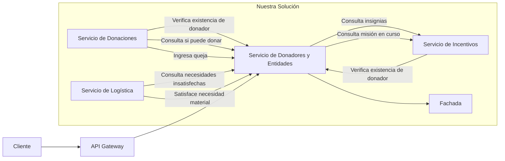

# Diagrama de despliegue

El siguiente diagrama representa el despliegue lógico del componente Donadores y Entidades dentro de la solución general, mostrando únicamente las conexiones relevantes para este componente.

