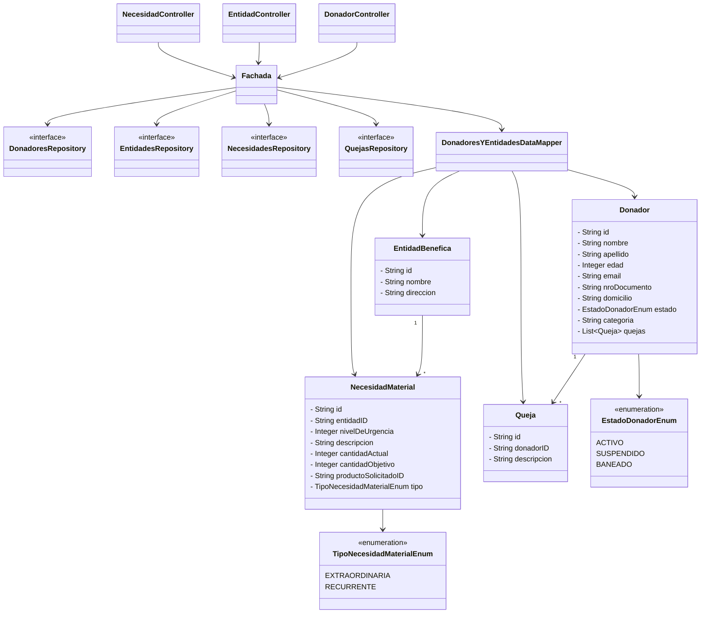

# Diagrama de Clases - Donadores y Entidades

```mermaid
classDiagram

class Donador {
  - String id
  - String nombre
  - String apellido
  - Integer edad
  - String email
  - String nroDocumento
  - String domicilio
  - EstadoDonadorEnum estado
  - String categoria
  - List~Queja~ quejas
}

class EntidadBenefica {
  - String id
  - String nombre
  - String direccion
}

class NecesidadMaterial {
  - String id
  - String entidadID
  - Integer nivelDeUrgencia
  - String descripcion
  - Integer cantidadActual
  - Integer cantidadObjetivo
  - String productoSolicitadoID
  - TipoNecesidadMaterialEnum tipo
}

class Queja {
  - String id
  - String donadorID
  - String descripcion
}

class EstadoDonadorEnum {
  <<enumeration>>
  ACTIVO
  SUSPENDIDO
  BANEADO
}

class TipoNecesidadMaterialEnum {
  <<enumeration>>
  EXTRAORDINARIA
  RECURRENTE
}

class DonadoresRepository {
  <<interface>>
}

class EntidadesRepository {
  <<interface>>
}

class NecesidadesRepository {
  <<interface>>
}

class QuejasRepository {
  <<interface>>
}


class DonadoresYEntidadesDataMapper

class Fachada

class DonadorController
class EntidadController
class NecesidadController


Donador "1" --> "*" Queja
EntidadBenefica "1" --> "*" NecesidadMaterial

NecesidadMaterial --> TipoNecesidadMaterialEnum
Donador --> EstadoDonadorEnum

DonadoresYEntidadesDataMapper --> Donador
DonadoresYEntidadesDataMapper --> EntidadBenefica
DonadoresYEntidadesDataMapper --> NecesidadMaterial
DonadoresYEntidadesDataMapper --> Queja

Fachada --> DonadoresRepository
Fachada --> EntidadesRepository
Fachada --> NecesidadesRepository
Fachada --> QuejasRepository
Fachada --> DonadoresYEntidadesDataMapper

DonadorController --> Fachada
EntidadController --> Fachada
NecesidadController --> Fachada
```